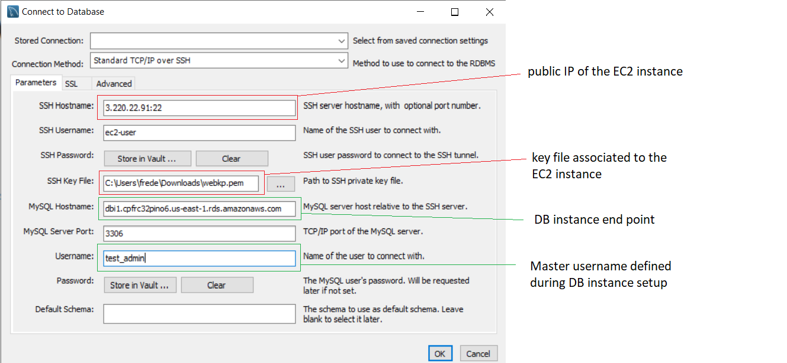

# AWS mySQL RDS pythonAccess  
Steps to setup and access data in RDS instance from python scripts located on an EC2 instance  

In this AWS project, we will create a database located on a RDS instance only accessible from an EC2 instance. We will then run Python scripts from the EC2 instance to:
 * add data to the database
 * retrieve data from the database

Since the database is located on a private instance, the data is protected. Still, we can interact with it through the publicly accessible EC2 instance.

Requirements:
you will need mySQL Workbench in order to act as administrator on your remote database server, i.e. add a database, a table and a user

## Step 1: in your AWS account

### VPC services

* Setup a VPC + attach an Internet Gateway
* Create a public subnet in AZ X (ie add IGW routing in the route table)
* Create two private subnets, one in AZ X, the other in AZ Y. This is required from AWS when we want to add a RDS instance

### EC2 services

* Create an instance in your public subnet (standard Linux AMI is fine)
* Make sure to attach a security group that allows Inbound ssh connectivity
* Allocate an Elastic IP so we can ssh into the instance

### RDS services
 * Databases tab, create Database
 * set up the database as follows

 | Parameter | Value |
 | --- | --- |
 | Creation Method | Standard Create |
 | Engine | MySQL |
 | Edition | MySQL 5.7.22 |
 | DB Instance Identifier | dbi1 |
 | Master username | test_admin |
 | Master password | test_admin_pwd |
 | Connectivity | choose your VPC |
 | Additional connectivity configuration: subnet group | create new |
 | Additional connectivity configuration: Publicly accessible | No |
 | Additional connectivity configuration: VPC security group | create new: rds_SG |
 | db authentication | password authentication |

Whilst the DB instance is being created, select the VPC security group rds_vpc you just created and make the following changes:  
Inbound: All TCP source  
Source: privIP/32 (where privIP is the private IP of the EC2 instance you created in EC2 Services step).  
This allows the EC2 instance to communicate via TCP with the database server.

## Step 2: in mySQL Workbench

### Connecting to the DB instance via our EC2 instance

* Database/Connect to Database
* We'll use Standard TCP/IP over SSH as the connection method. This allows Workbench to connect to the DB server via our public instance

### Creating the database and a simple table

* This is done using the following SQL script, which you can run in Workbench.

CREATE DATABASE db_users;  
CREATE TABLE db_users.tbl_users(  
  userId INT PRIMARY KEY NOT NULL AUTO_INCREMENT,  
  firstName VARCHAR(45) NOT NULL,  
  lastName VARCHAR(45) NOT NULL  
);  

### Setting up a user with appropriate rights (read/write)

* In the administration section, Users and privileges, add a user , set their password, and in the schema privileges, select db_users (the database we just created), and tick the following under Object Rights: SELECT, INSERT, UPDATE.  
Note: The user name and password will be used in both Python scripts to connect to the database. In this example, the user name was set to test_user and the password to Test_user_1.

## Step 3: Interacting with the database from our EC2 instance

### Adapting the Python files db_addData.py and db_getData.py

We'll use mysql.connector Python library to connect to the database. This library uses a cnx object to interact with the data base and is created as follows:

cnx = mysql.connector.connect(user='test_user',       password='Test_user_1',  
host='dbi1.xxx.us-east-1.rds.amazonaws.com',  
database='db_users')

| Parameter | Description |
| --- | --- |
| user | the username for the user setup in Workbench |
| password | the associated password |
| host | the DB instance endpoint |
| database | name of the database |

Make the appropriate changes to the cnx object in both Python files to reflect your setup (in particular 'host').

### Copy both scripts to your EC2 instance

### Testing the scripts

* Running the Python scripts requires that Python be installed on the remote EC2 instance, as well as the mysql.connector library. Now's time to connect to the EC2 instance! What follows assumes you used a standard Linux AMI.

<b>First update your machine:</b>  
$ sudo yum update -y

<b>To check Python is installed </b>  
$ Python --version
if this fails, you'll need to install Python on the machine.

<b>Install pip: (this will be used to install mysql.connector and it looks like it is not installed by default on Linux instances)  </b>  
$ curl https://bootstrap.pypa.io/get-pip.py -o get-pip.py  
$ python get-pip.py --user

<b>Install mysql.connector</b>   
$ pip install mysql-connector-python --user

* We're now ready to test the scripts from our EC2 instance.

* Navigate to the directory where the python files db_addData.py and db_getData.py are located.

* To add data to the table:  
$ python db_addData.py John Smith  
$ python db_addData.py Fred Ferriere

* To print the content of the table:  
$ python db_getData.py

If you try to run those scripts from your local machine, you'll get an error during the cnx instantation method. This is because the remote DB instance is not publicly accessible and may only be accessed from within the VPC. In our example, this access is even restricted to a single IP (defined in the rds_vpc Security Group).
